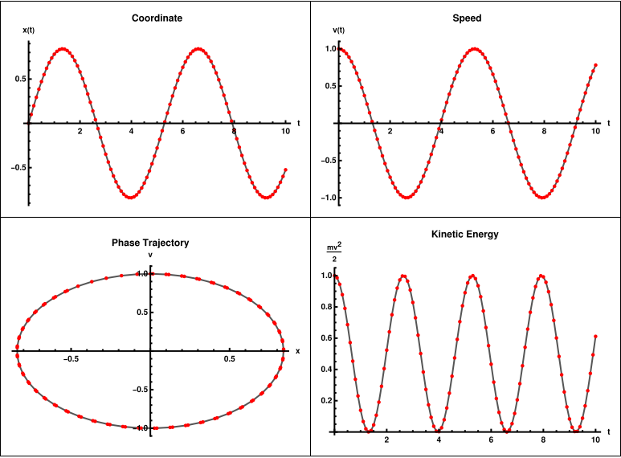

|[<- to README.md](..) | |
| - | - |
|**Header** | [`#include "GSE/ode.hpp"`](https://github.com/DmitriBogdanov/GSE/blob/master/include/GSE/ode.hpp) |
|**Namespace** | `gse::ode` |
|**Contents** | [ODE](https://en.wikipedia.org/wiki/Ordinary_differential_equation) solvers and their building blocks |

# gse::ode

ODE solver module of the library. Includes solver function, ODE integration methods and some building blocks for custom integrators.

> [!Tip]
> Seeing [usage examples](#usage) first might be helpful.

## Definitions

```cpp
// - Solver -
template <Extent N, class Func, class Callback, class Integrator = integrators::RK4<N>>
void solve(Func&&       f,                         // system RHS
           Vector<N>    y0,                        // initial condition
           Scalar       t0,                        // time interval start
           Scalar       t1,                        // time interval end
           Callback&&   callback,                  // callback to export the result
           Scalar       callback_frequency,        // how often to invoke 'callback'
           Integrator&& integrator = Integrator{}, // integration method
           bool         verify     = true          // whether to test for divergence
);

// - Integrator building blocks -
// Defaults
namespace defaults {
    constexpr Scalar tau                   = 1e-3;
    constexpr Scalar newton_precision      = 1e-12;
    constexpr Scalar newton_max_iterations = 100;
    constexpr Scalar tau_min               = 1e-8;
    constexpr Scalar tau_max               = 1e-1;
    constexpr Scalar tolerance             = 1e-8;
    constexpr Scalar fact                  = 0.7;
    constexpr Scalar factmin               = 0.7;
    constexpr Scalar factmax               = 1.5;
}

// Integrator state
template <Extent N = dynamic_size>
struct Base {
    Scalar tau = defaults::tau; // time step
};

template <Extent N = dynamic_size>
struct AdaptiveBase : Base<N> {
    Scalar tau_min = defaults::tau_min; // hard min on 'tau' adaptation
    Scalar tau_max = defaults::tau_max; // hard max on 'tau' adaptation

    Scalar tolerance = defaults::tolerance; // error tolerance
    Scalar fact      = defaults::fact;      // usually [0.7, 0.9], our confidence in the error estimate
    Scalar factmin   = defaults::factmin;   // usually [0.2, 0.7], limits how fast 'tau' can shrink
    Scalar factmax   = defaults::factmax;   // usually [1.5, 5.0], limits how fast 'tau' can grow
};

template <Extent N = dynamic_size>
struct ImplicitBase : Base<N> {
    Scalar newton_precision      = defaults::newton_precision;
    Scalar newton_max_iterations = defaults::newton_max_iterations;
};

// - Integrators -
// Non-stiff
template <Extent N = dynamic_size> struct Euler    : Base<N>;
template <Extent N = dynamic_size> struct RK2      : Base<N>;
template <Extent N = dynamic_size> struct RK4      : Base<N>;
template <Extent N = dynamic_size> struct AdamsRK4 : Base<N>;
// Non-stiff, adaptive
template <Extent N = dynamic_size> struct RK4RE   : AdaptiveBase<N>;
template <Extent N = dynamic_size> struct DOPRI45 : AdaptiveBase<N>;
// Stiff
template <Extent N = dynamic_size> struct TrapezoidalRule : ImplicitBase<N>;
template <Extent N = dynamic_size> struct ImplicitEuler   : ImplicitBase<N>;
```

## Methods

### Solver

> ```cpp
> FUNC:
> ```

DESC:

### Integrator building blocks

> ```cpp
> FUNC:
> ```

DESC:

> ```cpp
> FUNC:
> ```

DESC:

> ```cpp
> FUNC:
> ```

DESC:

> ```cpp
> FUNC:
> ```

DESC:

### Integrators

> ```cpp
> FUNC:
> ```

DESC:

| Integrator        | Order | Stability | Adaptive | Explicit | Single-step | Stiff | Symplectic |
| ----------------- | ----- | --------- | -------- | -------- | ----------- | ----- | ---------- |
| `Euler`           | 1     |           | ✘        | ✔        | ✔           | ✘     | ✘          |
| `RK2`             | 2     |           | ✘        | ✔        | ✔           | ✘     | ✘          |
| `RK4`             | 4     |           | ✘        | ✔        | ✔           | ✘     | ✘          |
| `AdamsRK4`        | 4     |           | ✔        | ✔        | ✘           | ✘     | ✘          |
| `RK4RE`           | 5     |           | ✔        | ✔        | ✔           | ✘     | ✘          |
| `DOPRI45`         | 5     |           | ✘        | ✔        | ✔           | ✘     | ✘          |
| `ImplicitEuler`   | 1     | L         | ✘        | ✘        | ✔           | ✔     | ✘          |
| `TrapezoidalRule` | 2     | A         | ✘        | ✘        | ✔           | ✔     | ✔          |

## Usage

### Solving an ODE

> [!Note]
> This example uses [utl::json](https://github.com/DmitriBogdanov/UTL/blob/master/docs/module_json.md) for data export, this pairs really well using with [Mathematica](https://en.wikipedia.org/wiki/Wolfram_Mathematica) for visualization.

[Harmonic oscillator](https://en.wikipedia.org/wiki/Harmonic_oscillator) is described by the following ODE system:
$$
\begin{cases}
\dot{x} = v, \\
\dot{v} = -\dfrac{k}{m}x
\end{cases}
$$

Let's define $k/m = \sqrt{2}$ and set initial state to $x(0) = 1$, $v(0) = 0$.

The code for integrating ODE for $t \in [0, 10]$ and exporting solution as JSON will look as follows:

[ [Run this code]() ]

```cpp
// ODE Problem (harmonic oscillator equation)
const auto f = [](gse::Scalar, const gse::Vector<2>& u) -> gse::Vector<2> {
    return { u[1], -std::sqrt(2) * u[0] };
};

const gse::Vector<2>  y0 = {0, 1};
const gse::Scalar     t0 = 0;
const gse::Scalar     t1 = 10;

// Callback to export step info as JSON
utl::json::Node json;

const auto callback = [&](gse::Scalar t, const gse::Vector<2>& y0, const auto& integrator) {
    utl::json::Node step_info;
    
    step_info["t"]   = t;
    step_info["y"]   = gse::to_std(y0);
    step_info["tau"] = integrator.tau;
    
    json["solution"].push_back(std::move(step_info));
};

// (optional) Select integrator
gse::ode::integrators::DOPRI45<2> integrator;
integrator.tau       = 1e-3;
integrator.tolerance = 1e-6;

// Solve for 't' in [0, 10], export results at 100 intermediate time steps
gse::ode::solve(f, y0, t0, t1, callback, (t1 - t0) / 100, integrator);

json.to_file("solution.json");
```

Solution graph:



Solution format:

```json
{
    "solution": [
        {
            "t": 0,
            "tau": 0.001,
            "y": [ 0, 1 ]
        },
        // ... and so on
    ]
}
```

### Questions & answers

**Q: What if system size is not known at compile time?**

**A:** Use `gse::Vector<>` instead of `gse::Vector<N>`.

**Q: What if system is stiff?**

**A:** Use stiff integrators (`ImplicitEuler`, `TrapezoidalRule`, ...).

**Q: What if system is dynamic & needs to preserve energy?**

**A:** Use symplectic integrators (...).

**Q: What if I want to use integration method that isn't present in this library?**

**A:** Custom integrators are rather easy to define, see [example](#creating-custom-integrator) below. Pull requests with more methods are also welcome.

**Q: What if I prefer to use solver with Eigen3 vectors?**

**A:** No problems with that, `gse::Vector<N>` is simply a typedef for `Eigen::Vector<double, N>`. See docs for the [core module]().

**Q: Is there any good literature on the topic?**

**A:** The classic choice would be `E. Hairer G. Wanner "Solving ordinary differential equations"`. The book is rather old, but it covers all the basic theory on numeric integration of ODEs.

### Creating custom integrator

Below is an example of how to define a 2nd order Runge-Kutta integrator compatible with the library.

```cpp
template <gse::Extent N = gse::dynamic_size>
struct RK2 : gse::ode::integrators::Base<N> {
    
    template <class Func>
    void operator()(Func&& f, gse::Scalar& t, gse::Vector<N>& y0) {
        
        const gse::Vector<N> k1 = f(t, y0);
        const gse::Vector<N> k2 = f(t + this->tau, y0 + this->tau * k1);
        
        y0 += this->tau * (0.5 * k1 + 0.5 * k2);
        t  += this->tau;
    }
};
```

The only thing required from an integrator to be valid is `operator()` with a given signature.

Inheriting a base class like `integrators::Base<N>` allows us to pull in some standard member fields with their default values (`tau` in this case), reducing boilerplate. This is not a requirement, integrator can define any fields it sees fit, which can be used to expose some intermediate data for callback export. This is mostly useful when working on complex problems where intermediate state can be useful for debugging.

For example, let's define a 2nd order Runge-Kutta integrator which uses `time_step` instead of `tau` and exposes intermediate values of `k1`, `k2`:

```cpp
template <gse::Extent N = gse::dynamic_size>
struct RK2 {

    gse::Scalar    time_step = gse::ode::defaults::tau;
    gse::Vector<N> k1;
    gse::Vector<N> k2;

    template <class Func>
    void operator()(Func&& f, gse::Scalar& t, gse::Vector<N>& y0) {

        this->k1 = f(t, y0);
        this->k2 = f(t + this->time_step, y0 + this->time_step * k1);

        y0 += this->time_step * (0.5 * k1 + 0.5 * k2);
        t  += this->time_step;
    }
};
```

In a similar fashion it is possible to define adaptive, multi-step and implicit methods, use [`ode.hpp`]((https://github.com/DmitriBogdanov/GSE/blob/master/include/GSE/ode.hpp)) as a reference.